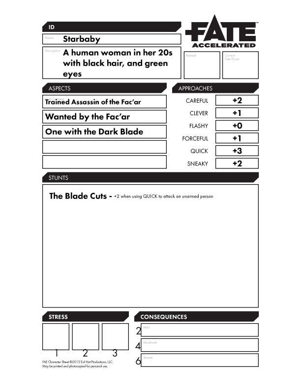

+++
title = "Sydney Daniels, AKA Starbaby"
+++
Sydney Daniels was born in Iowa on a farm just outside of Des Moines.  Her family owned the farm until she was five, when
they had to sell it to a large commercial agriculture company.  They were allowed to continue to live on the farm and
work the fields, but the company was taking most of the profit.

Sydney was seven years old when the Fac'ar abducted her from her house. She was given as a present to the empress of the
Fac'ar, Gra'hera Lei, where she was treated as a servant girl until she was old enough to be trained as a member of the
Lian-Che, the royal assassins of the Fac'ar Empire.

She quickly rose to through the ranks of the Lian-Che, becoming the personal bodyguard of Gra'hera Lei.  When the Fac'ar
declared war on the Walanti, and the Lian-Che were sent to rid the Walanti of their Magorice, Sydney remained behind
to protect Gra'hera Lei, but Sydney had other plans.  During the sleeping times, Sydney slipped into Gra'hera Lei's
chambers, and ran her through with a dark blade, ending her life in the quiet of the night.

Then, she stole a small transport ship and escaped the Fac'ar's grasp, but she knows she isn't safe.  She has taken the
moniker "Starbaby" in the hopes that the Fac'ar will not be able to trace her.  She ditched the ship on a small outpost
moon in the Silvanis System.

